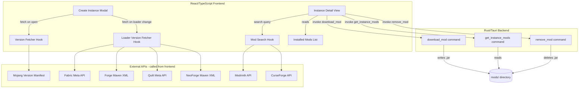

# Design Document: Minecraft Version & Mod Management

## Overview

This design covers three interconnected features for the Critical launcher:

1. **Dynamic Version Fetching** — Live API calls replace hardcoded dropdowns in the Create Instance modal.
2. **Custom Modpack Instances** — Non-Vanilla instances get a dedicated detail view for mod management.
3. **Mod Browsing & Adding** — Users search Modrinth/CurseForge for individual mods and download them into an instance's `mods/` folder.

The architecture keeps the existing Tauri split: the React/TypeScript frontend handles UI state and direct API calls to public mod/version APIs, while the Rust backend handles all filesystem operations (downloading files, reading `mods/` directories, writing `.jar` files).

---

## Architecture



**Key design decisions:**

- Version and mod search API calls happen from the frontend (same pattern as the existing `searchModpacks` function). This avoids adding HTTP client complexity to the Rust backend for read-only API calls.
- File system operations (download, list, delete mods) go through Tauri commands because the frontend cannot write to arbitrary filesystem paths.
- The existing `InstanceMeta` struct in Rust is extended with an optional `loader_version` field to remain backward-compatible with existing instances.

---

## Components and Interfaces

### Frontend Components

#### `useMinecraftVersions` hook
Fetches and caches Minecraft versions from the Mojang manifest. Returns `{ versions, isLoading, error }`. Caches result in a module-level variable for the session lifetime.

#### `useLoaderVersions` hook
Fetches loader versions given a `(mcVersion, loader)` pair. Returns `{ loaderVersions, isLoading, error }`. Triggered reactively when either input changes.

#### `useModSearch` hook
Accepts `{ query, mcVersion, loader }` and returns `{ results, isLoading, error }`. Queries Modrinth and optionally CurseForge in parallel.

#### `InstanceDetailView` component
New view rendered when a user clicks on an instance card. Shows:
- Instance metadata (name, version, loader, play time)
- Installed mods list (from `get_instance_mods` command)
- Browse Mods section (uses `useModSearch`)

#### Updated `CreateInstanceModal`
- Version dropdown populated by `useMinecraftVersions`
- Loader version dropdown (hidden for Vanilla) populated by `useLoaderVersions`
- Passes `loader_version` to `create_instance` command

### Tauri Commands (Rust)

#### `get_instance_mods(name: String) -> Result<Vec<ModFile>, String>`
Reads the `mods/` directory of the named instance and returns metadata for each `.jar` file.

#### `download_mod(instance_name: String, mod_url: String, filename: String) -> Result<String, String>`
Downloads a `.jar` from `mod_url` using `reqwest` and writes it to `instances/{name}/mods/{filename}`. Returns the final path on success.

#### `remove_mod(instance_name: String, filename: String) -> Result<String, String>`
Deletes `instances/{name}/mods/{filename}`. Returns an error if the file does not exist.

---

## Data Models

### Updated `InstanceMeta` (Rust)

```rust
#[derive(Serialize, Deserialize)]
struct InstanceMeta {
    name: String,
    version: String,
    mod_loader: String,
    #[serde(default)]
    loader_version: Option<String>,  // new optional field
    play_time_minutes: u64,
}
```

The `#[serde(default)]` ensures existing `instance.json` files without `loader_version` deserialize correctly.

### `ModFile` (Rust → Frontend)

```rust
#[derive(Serialize)]
struct ModFile {
    filename: String,
    size_bytes: u64,
}
```

### `MinecraftVersion` (Frontend TypeScript)

```typescript
interface MinecraftVersion {
  id: string;        // e.g. "1.20.4"
  type: "release" | "snapshot" | "old_beta" | "old_alpha";
  releaseTime: string;
}
```

### `LoaderVersion` (Frontend TypeScript)

```typescript
interface LoaderVersion {
  version: string;   // e.g. "0.15.11"
  stable: boolean;
}
```

### `ModSearchResult` (Frontend TypeScript)

```typescript
interface ModSearchResult {
  id: string;
  title: string;
  author: string;
  description: string;
  iconUrl: string;
  downloadCount: number;
  source: "modrinth" | "curseforge";
  latestFileUrl: string;   // resolved download URL for the compatible version
  filename: string;        // suggested .jar filename
}
```

---

## API Integration Details

### Mojang Version Manifest
```
GET https://launchermeta.mojang.com/mc/game/version_manifest_v2.json
```
Response shape: `{ versions: [{ id, type, releaseTime, ... }] }`
Filter to `type === "release"` for the default list; optionally include `"snapshot"`.

### Fabric Meta API
```
GET https://meta.fabricmc.net/v2/versions/loader/{mcVersion}
```
Returns an array of `{ loader: { version, stable } }` objects.

### Forge Maven XML
```
GET https://files.minecraftforge.net/net/minecraftforge/forge/maven-metadata.xml
```
Returns XML. Parse `<version>` tags, filter those starting with `{mcVersion}-`.

### Quilt Meta API
```
GET https://meta.quiltmc.org/v3/versions/loader/{mcVersion}
```
Returns an array of `{ loader: { version } }` objects.

### NeoForge Maven XML
```
GET https://maven.neoforged.net/releases/net/neoforged/neoforge/maven-metadata.xml
```
Returns XML. Parse `<version>` tags, filter those starting with the minor version of `mcVersion` (e.g. `"21.1"` for `"1.21.1"`).

### Modrinth Mod Search
```
GET https://api.modrinth.com/v2/search
  ?query={query}
  &facets=[["project_type:mod"],["versions:{mcVersion}"],["categories:{loader}"]]
  &limit=50
```

### Modrinth Version Resolution
```
GET https://api.modrinth.com/v2/project/{projectId}/version
  ?game_versions=["{mcVersion}"]
  &loaders=["{loader}"]
```
Take the first result's `files[0]` for the download URL and filename.

### CurseForge Mod Search
```
GET https://api.curseforge.com/v1/mods/search
  ?gameId=432
  &classId=6        (classId 6 = Mods, not 4471 which is Modpacks)
  &searchFilter={query}
  &gameVersion={mcVersion}
  &modLoaderType={loaderEnum}
```
`loaderEnum`: Forge=1, Fabric=4, Quilt=5, NeoForge=6.

---

## Correctness Properties

*A property is a characteristic or behavior that should hold true across all valid executions of a system — essentially, a formal statement about what the system should do. Properties serve as the bridge between human-readable specifications and machine-verifiable correctness guarantees.*


### Property 1: Version list contains only releases

*For any* valid Mojang version manifest response, the version dropdown populated by the Launcher should contain exactly the versions whose `type` is `"release"` — no more, no fewer.

**Validates: Requirements 1.2**

---

### Property 2: Version cache idempotence

*For any* session where the version list has been fetched once, fetching it again should return the same list without making a new network request (call count stays at 1).

**Validates: Requirements 1.3**

---

### Property 3: Loader version API routing

*For any* non-Vanilla mod loader selection (Fabric, Forge, Quilt, NeoForge), the Launcher should call exactly the API endpoint associated with that loader and no other loader's endpoint.

**Validates: Requirements 2.1**

---

### Property 4: Default loader version is latest stable

*For any* list of loader versions returned by an API, the default selected version in the dropdown should be the first version in the list where `stable === true` (or the first version overall if none are marked stable).

**Validates: Requirements 2.2**

---

### Property 5: Instance metadata round-trip

*For any* instance created with a specific `loader_version`, reading the `instance.json` file back and deserializing it should produce an `InstanceMeta` with the same `loader_version` value.

**Validates: Requirements 2.6**

---

### Property 6: Non-Vanilla instances appear in modded list

*For any* instance created with a non-Vanilla mod loader, that instance should appear in the "Modpacks" sub-tab list and not in the "Vanilla" sub-tab list.

**Validates: Requirements 3.1, 3.3**

---

### Property 7: Instance creation produces mods directory

*For any* valid instance name and mod loader, after `create_instance` succeeds, the `mods/` subdirectory should exist within the instance folder.

**Validates: Requirements 3.2**

---

### Property 8: Mod search results contain required display fields

*For any* mod search result returned by Modrinth or CurseForge, the rendered result card should contain the mod's name, author, description, download count, and source label.

**Validates: Requirements 4.4**

---

### Property 9: Mod search filters by instance version and loader

*For any* search query submitted from a Custom_Modpack instance's detail view, the API request should include the instance's Minecraft version and mod loader as filter parameters.

**Validates: Requirements 4.2**

---

### Property 10: Mod download round-trip

*For any* mod added to an instance, after `download_mod` succeeds, calling `get_instance_mods` for that instance should return a list containing a `ModFile` with the expected filename.

**Validates: Requirements 5.2, 5.3**

---

### Property 11: Failed download leaves mods directory unchanged

*For any* failed `download_mod` call (simulated network error or bad URL), the set of files in the instance's `mods/` directory should be identical before and after the call.

**Validates: Requirements 5.5**

---

### Property 12: Installed mods list reflects filesystem state

*For any* instance directory containing N `.jar` files in `mods/`, `get_instance_mods` should return exactly N entries, each with the correct filename and file size in bytes.

**Validates: Requirements 6.1, 6.2**

---

### Property 13: Mod removal round-trip

*For any* mod file present in an instance's `mods/` directory, after `remove_mod` succeeds, calling `get_instance_mods` should return a list that does not contain that filename.

**Validates: Requirements 6.3, 6.5**

---

## Error Handling

| Scenario | Behavior |
|---|---|
| Mojang API unreachable | Show fallback hardcoded versions; display warning badge on dropdown |
| Loader API unreachable | Show error message below loader version dropdown; allow proceeding without loader version |
| Mod search API failure (one provider) | Show results from the other provider; display per-provider error badge |
| Mod search API failure (all providers) | Show "Search unavailable" message |
| `download_mod` network failure | Return `Err` from Tauri command; frontend shows error toast; no file written |
| `download_mod` duplicate filename | Frontend checks existing mods list before invoking; shows confirmation dialog |
| `remove_mod` file not found | Return `Err("Mod file not found")`; frontend shows error toast |
| `remove_mod` permission error | Return `Err` with OS error message; frontend shows error toast |
| Instance name collision on create | Existing behavior: Rust returns `Err("An instance with this name already exists!")` |

---

## Testing Strategy

### Dual Testing Approach

Both unit tests and property-based tests are required. Unit tests cover specific examples, edge cases, and error conditions. Property tests verify universal correctness across many generated inputs.

### Property-Based Testing

**Library**: `fast-check` (TypeScript/frontend) for frontend hooks and rendering logic; `proptest` (Rust) for backend Tauri commands.

Each property test runs a minimum of **100 iterations**.

Each test is tagged with a comment in the format:
`// Feature: minecraft-version-and-mod-management, Property N: <property_text>`

| Property | Test Type | Component |
|---|---|---|
| Property 1: Version list contains only releases | Property (fast-check) | `useMinecraftVersions` hook |
| Property 2: Version cache idempotence | Property (fast-check) | `useMinecraftVersions` hook |
| Property 3: Loader version API routing | Property (fast-check) | `useLoaderVersions` hook |
| Property 4: Default loader version is latest stable | Property (fast-check) | `useLoaderVersions` hook |
| Property 5: Instance metadata round-trip | Property (proptest) | `create_instance` + `get_instances` |
| Property 6: Non-Vanilla instances in modded list | Property (fast-check) | Instance list filtering logic |
| Property 7: Instance creation produces mods directory | Property (proptest) | `create_instance` command |
| Property 8: Mod search results contain required fields | Property (fast-check) | Mod result rendering |
| Property 9: Mod search filters by version and loader | Property (fast-check) | `useModSearch` hook |
| Property 10: Mod download round-trip | Property (proptest) | `download_mod` + `get_instance_mods` |
| Property 11: Failed download leaves mods unchanged | Property (proptest) | `download_mod` error path |
| Property 12: Installed mods list reflects filesystem | Property (proptest) | `get_instance_mods` command |
| Property 13: Mod removal round-trip | Property (proptest) | `remove_mod` + `get_instance_mods` |

### Unit Tests

Unit tests focus on:
- Specific API response parsing (Forge XML parsing, NeoForge version string filtering)
- Edge cases: empty version manifest, loader with no stable versions, empty `mods/` directory
- Error conditions: API failures returning fallback data, download failures leaving state unchanged
- UI state: loading indicators, disabled buttons, Vanilla loader hiding the version dropdown
